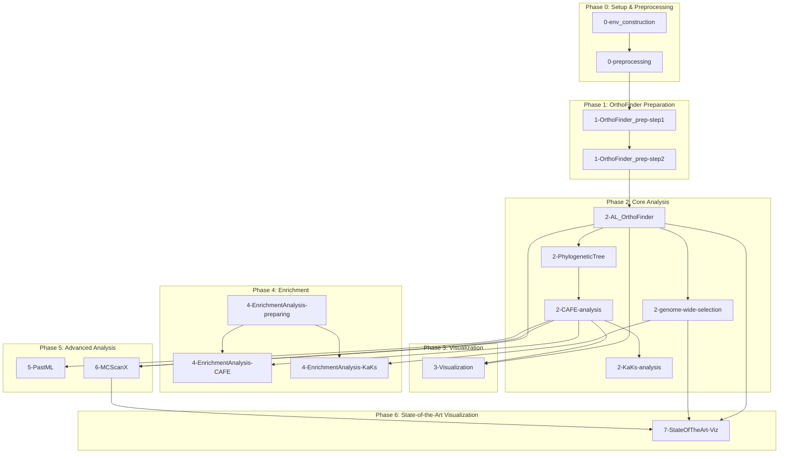

# Comparative Genomics Analysis Pipeline

A comprehensive comparative genomics pipeline for analyzing gene family evolution, selection pressure, and synteny across 12 cypriniform fish species, with *Aspiorhynchus laticeps* (Xinjiang big-head fish) as the focal species.

## Pipeline Overview



## Execution Order

```
Phase 0: Environment & Preprocessing (run once)
    └── 0-env_construction → 0-preprocessing

Phase 1: Data Preparation
    └── 1-step1 → 1-step2

Phase 2: Core Analysis (run in order)
    └── 2-OrthoFinder → 2-PhylogeneticTree → 2-CAFE → 2-KaKs
                    └── 2-genome-wide-selection (parallel track)

Phase 3-5: Downstream Analysis (can run in parallel after Phase 2)
    ├── 3-Visualization
    ├── 4-preparing → 4-CAFE-enrichment / 4-KaKs-enrichment
    ├── 5-PastML
    └── 6-MCScanX

Phase 6: State-of-the-Art Visualization (after Phase 2-5)
    └── 7-StateOfTheArt-Visualization (uses OrthoFinder, Ka/Ks, synteny results)
```

---

## Phase 0: Setup & Preprocessing

### `0-ultimate-env_construction.qmd`
**Purpose:** Complete environment setup for the entire pipeline

**Creates 9 conda environments:**
| Environment | Tools |
|-------------|-------|
| `env_biopython` | BioPython, Pandas, NumPy, Matplotlib, Seaborn |
| `env_orthofinder` | OrthoFinder 3.0.1b1 |
| `bioconductor-clusterprofiler_env` | clusterProfiler (R) |
| `eggnog_env` | EggNOG-mapper 2.1.12 |
| `pastml_env` | PastML 1.9.50 |
| `gff2bed_env` | BEDOPS utilities |
| `genome_annotation_env` | RepeatModeler, RepeatMasker, BUSCO |
| `braker3_env` | BRAKER3, AUGUSTUS, GeneMark-ETP |
| `cafe5_env` | CAFE5 |

**Registers 5 Jupyter kernels:** Python (env_biopython), R (clusterProfiler), Julia

---

### `0-ultimate-preprocessing.qmd`
**Purpose:** Genome annotation pipeline for the 12 raw genome assemblies

**Pipeline stages:**
1. **Repeat Masking** - RepeatModeler + RepeatMasker
2. **Gene Prediction** - BRAKER3 with OrthoDB protein evidence
3. **Sequence Extraction** - Protein (braker.aa) and CDS (braker.codingseq)
4. **Quality Assessment** - BUSCO with actinopterygii_odb12 lineage

**Inputs:** Raw genome FASTA files (`.fna`) from NCBI
**Outputs:**
- `./Outputs/Preprocessing/BRAKER_UNMASKED/{species}/braker.aa` (proteins)
- `./Outputs/Preprocessing/BRAKER_UNMASKED/{species}/braker.codingseq` (CDS)

---

## Phase 1: OrthoFinder Preparation

### `1-ultimate-OrthoFinder_preparation-step1.qmd`
**Purpose:** Extract protein sequences from genome annotations

**Process:**
- Parse FNA (genome) + GFF3 (annotation) file pairs
- Translate CDS features to protein sequences
- Parallel processing with multiprocessing.Pool

**Outputs:** `./DB/GENOME_Comparison/FAA/{species}.faa`

---

### `1-ultimate-OrthoFinder_preparation-step2.qmd`
**Purpose:** Handle header mismatches between FNA and GFF3 files

**Addresses common issues:**
- Case sensitivity (Chr1 vs chr1)
- Naming conventions (chromosome vs scaffold vs contig)
- Complex headers requiring pattern extraction

**Standardization threshold:** Files with <80% header match require standardization

---

## Phase 2: Core Analysis

### `2-ultimate-AL_OrthoFinder.qmd`
**Purpose:** Orthology inference via OrthoFinder - **foundation for all downstream analysis**

**Method:**
- All-vs-all Diamond BLAST searches
- MCL clustering for orthogroup inference
- FastTree + MAFFT for gene/species trees

**Key outputs:**
- `Orthogroups/Orthogroups.tsv` - Gene family membership
- `Orthogroups/Orthogroups.GeneCount.tsv` - Gene counts per species
- `Species_Tree/SpeciesTree_rooted.txt` - Inferred species phylogeny
- `Gene_Trees/` - Individual gene family trees
- `MultipleSequenceAlignments/` - MSAs for each orthogroup

**Runtime:** ~20 hours (128 threads for BLAST)

---

### `2-ultimate-PhylogeneticTreeEstimation.qmd`
**Purpose:** Convert OrthoFinder tree to ultrametric format for CAFE5

**Why ultrametric?**
- CAFE5's birth-death model requires time-calibrated trees
- Original OrthoFinder trees have branch lengths in substitutions/site
- Ultrametric trees have all tips equidistant from root (equal time)

**Method:** Average distance method or OrthoFinder's `make_ultrametric.py`

---

### `2-ultimate-CAFE-analysis.qmd`
**Purpose:** Detect gene families with significant expansion/contraction

**CAFE5 Analysis:**
- Stochastic birth-death model for gene family evolution
- Lambda parameter = probability of gain/loss per gene per time unit
- Filters families with max copy >100 (convergence issues)

**Three model runs:**
1. Single lambda (baseline)
2. With error model
3. Multi-lambda (k=3 gamma categories)

**Outputs:**
- `Base_family_results.txt` - Per-family p-values
- `Base_change.tab` - Per-species changes
- Species-specific expanded/contracted family lists

---

### `2-ultimate-KaKs-analysis.qmd`
**Purpose:** Selection analysis on CAFE-significant families only

**Two-tier approach:**
| Tier | Tool | Purpose | Speed |
|------|------|---------|-------|
| 1 | yn00 (PAML) | Pairwise Ka/Ks screening | Fast |
| 2 | codeml (PAML) | Branch model (foreground vs background) | Detailed |

**Selection categories:**
- **Ka/Ks > 1:** Positive selection
- **0.5 < Ka/Ks ≤ 1:** Relaxed purifying
- **0.1 < Ka/Ks ≤ 0.5:** Moderate purifying
- **Ka/Ks ≤ 0.1:** Strong purifying (essential genes)

---

### `2-genome-wide-selection-screen.qmd`
**Purpose:** Genome-wide Ka/Ks screening WITHOUT CAFE filtering

**Key insight:** Gene family size changes (CAFE) and sequence evolution (Ka/Ks) are **independent evolutionary signals**. This notebook captures genes under selection regardless of family size changes.

**Features:**
- Checkpoint system (saves every 500 orthogroups)
- Parallel processing (8 workers)
- Processes ~41,000 orthogroups

**Runtime:** ~5 hours

---

## Phase 3: Visualization

### `3-ultimate-Visualization4OrthoFinder.qmd`
**Purpose:** Publication-quality figures for OrthoFinder and CAFE results

**Generates:**
- Gene count distribution plots
- Species tree diagrams
- Duplication event visualizations
- CAFE expansion/contraction summaries

**Formats:** PNG (display) and PDF (publication)

---

## Phase 4: Enrichment Analysis

### `4-ultimate-EnrichmentAnalysis-preparing.qmd`
**Purpose:** Set up annotation infrastructure for enrichment analysis

**MUST run first before other Phase 4 notebooks**

**Creates:**
1. **EggNOG annotations** - Functional annotation via eggnog-mapper
2. **Gene-to-GO mappings** - `gene2go.txt`
3. **Gene-to-KEGG mappings** - `gene2pathway_name.txt`
4. **Custom OrgDb** - `org.Alaticeps.eg.db` (R Bioconductor format)

**Statistics:**
- 92,683 genes with annotations
- 43,245 genes with GO terms
- 45,567 genes with KEGG terms

---

### `4-ultimate-EnrichmentAnalysis4SpecificOGs.qmd`
**Purpose:** GO/KEGG enrichment for CAFE-significant families

**Analyzes three categories:**
| Category | Count | Definition |
|----------|-------|------------|
| CAFE-Expanded | 2,369 | p < 0.05, positive change in *A. laticeps* |
| CAFE-Contracted | 4,179 | p < 0.05, negative change in *A. laticeps* |
| Species-specific | varies | Unique to *A. laticeps* |

**Outputs:**
- `Tables/GO_enrichment_CAFE_*_results.csv`
- `Tables/KO_enrichment_CAFE_*_results.tsv`
- `Figures/GO_Enrichment/` and `Figures/KO_Enrichment/`

---

### `4-ultimate-EnrichmentAnalysis4SpecificOGs-KaKs.qmd`
**Purpose:** GO/KEGG enrichment for Ka/Ks selection categories

**Analyzes four categories:**
| Category | Count | Definition |
|----------|-------|------------|
| Positive Selection | 14,920 | max ω > 1 |
| Relaxed Purifying | 6,132 | 0.5 < mean ω ≤ 1.0 |
| Moderate Purifying | 14,558 | 0.1 < mean ω ≤ 0.5 |
| Strong Purifying | 2,162 | mean ω ≤ 0.1 |

---

## Phase 5: Advanced Analysis

### `5-ultimate-PastML.qmd`
**Purpose:** Ancestral state reconstruction for gene presence/absence

**Features:**
- Integrates with CAFE-significant families only (~1,200 vs ~28,000)
- 23x faster execution (1-2 hours vs 24+ hours)
- Generates interactive HTML maps

**Outputs:** `Figures/PastMLTrees_CAFE/OG*_map.html`

---

### `6-ultimate-MCScanX.qmd`
**Purpose:** Synteny analysis between species pairs

**Comparisons:**
- *A. laticeps* vs *Schizothorax macropogon*
- *A. laticeps* vs *Triplophysa bombifrons*

**Pipeline:**
1. All-vs-all BLASTP (e-value 1e-10)
2. GFF3 → BED format conversion
3. MCScanX collinear region detection
4. Visualization (dot plots, dual synteny, circle plots)

**CAFE Integration:** Maps expanded/contracted families to synteny blocks

---

## Phase 6: State-of-the-Art Visualization

### `7-ultimate-StateOfTheArt-Visualization.qmd`
**Purpose:** Modern visualization tools (2023-2025) for publication-quality figures

**Uses state-of-the-art tools identified in bioinformatics literature:**

| Tool | Language | Purpose | Key Feature |
|------|----------|---------|-------------|
| ggtree + treeio | R | dN/dS tree visualization | Native CodeML parsing with `read.codeml()` |
| ETE4 | Python | Interactive trees | smartview (no Xvfb required) |
| pyGenomeViz | Python | Synteny plots | Modern CLI, replaces MCScanX Java |
| pyCirclize | Python | Circular plots | Circos-style chord diagrams |
| karyoploteR | R | Chromosome maps | Ideograms with selection hotspots |
| ggstatsplot | R | Statistical plots | APA-formatted annotations |

**Key visualizations:**
- Species trees with branch coloring by ω (dN/dS)
- Circular genome plots with synteny links
- Chromosome ideograms showing selection hotspots
- Statistical scatter plots with correlation coefficients

**Outputs:**
```
Figures/StateOfTheArt/
├── trees/                    # Phylogenetic trees (ggtree, ETE4)
├── synteny_pygenomeviz/      # Modern synteny plots
├── circular_plots/           # Circos-style visualizations
├── karyotype/                # Chromosome ideograms
└── statistical_plots/        # ggstatsplot figures
```

**Prerequisites:** Run Section 11 of `0-ultimate-env_construction.qmd` to install visualization tools

---

## Configuration System

### `config/paths.yaml`
Centralized path configuration with variable interpolation:

```yaml
version: "Jan09"  # Change to update all OrthoFinder paths

base:
  project_root: "/home/jovyan"  # Docker container mount
  outputs: "${base.project_root}/Outputs"

orthofinder:
  results_dir: "${base.outputs}/OrthoFinder/Results_${version}"

species:
  focal: "Aspiorhynchus_laticeps"
```

### Path Loaders
- **Python:** `config/load_config.py` → `get_path("orthofinder.results_dir")`
- **R:** `config/load_config.R` → `get_path("orthofinder.results_dir")`

### Docker Path Mapping
| Context | Path |
|---------|------|
| Host | `<repository-root>/` (the directory you cloned; mounted into the container) |
| Container | `/home/jovyan/` |

**Critical:** Always use `/home/jovyan` in notebooks, not the host path.

---

## Species Analyzed

The 12 species and their NCBI accessions are the single source of truth in
[`../data/accessions.tsv`](../data/accessions.tsv); see the repository `README.md`
for the annotated species table.

| Species | Role |
|---------|------|
| ***Aspiorhynchus laticeps*** | **Focal (Set 2)** |
| ***Diptychus maculatus*** | **Focal (Set 3)** |
| *Carassius auratus* | Comparison |
| *Cyprinus carpio* | Comparison |
| *Danio rerio* | Comparison |
| *Gymnocypris eckloni* | Comparison |
| *Oxygymnocypris stewartii* | Comparison |
| *Schizopygopsis younghusbandi* | Comparison |
| *Sinocyclocheilus grahami* | Comparison |
| *Triplophysa pappenheimi* | Comparison |
| *Triplophysa tibetana* | Comparison |
| *Triplophysa yaopeizhii* | Comparison |

---

## Key Tools

### Core Analysis
| Tool | Version | Purpose |
|------|---------|---------|
| OrthoFinder | 3.0.1b1 | Orthology inference |
| CAFE5 | - | Gene family evolution |
| PAML (yn00, codeml) | - | Ka/Ks selection analysis |
| MCScanX | 1.0.0 | Synteny analysis |
| PastML | 1.9.50 | Ancestral state reconstruction |
| BRAKER3 | - | Gene prediction |
| clusterProfiler | 4.8.1 | GO/KEGG enrichment |
| EggNOG-mapper | 2.1.12 | Functional annotation |

### State-of-the-Art Visualization (2023-2025)
| Tool | Language | Purpose |
|------|----------|---------|
| ggtree + treeio | R | dN/dS tree visualization |
| ETE4 | Python | Interactive trees (smartview) |
| pyGenomeViz | Python | Modern synteny plots |
| pyCirclize | Python | Circos-style circular plots |
| karyoploteR | R | Chromosome ideograms |
| ggstatsplot | R | Statistical annotations |

---

## Output Structure

```
Outputs/
├── Preprocessing/
│   ├── RepeatModeler/{species}/
│   ├── RepeatMasker/{species}/
│   ├── BRAKER_UNMASKED/{species}/
│   └── BUSCO/{species}/
├── OrthoFinder/Results_{version}/
│   ├── Orthogroups/
│   ├── Species_Tree/
│   ├── Gene_Trees/
│   └── MultipleSequenceAlignments/
├── CAFE/
│   ├── cafe_results/
│   └── Aspiorhynchus_laticeps_analysis/
├── GenomewideSelection/
│   ├── yn00_results/
│   └── codeml_results/
├── Eggnog/
└── MCScanX_Results/

Notebooks/
├── Figures/
│   ├── GO_Enrichment/
│   ├── KO_Enrichment/
│   ├── PastMLTrees_CAFE/
│   └── StateOfTheArt/          # Modern visualization outputs
│       ├── trees/
│       ├── synteny_pygenomeviz/
│       ├── circular_plots/
│       ├── karyotype/
│       └── statistical_plots/
├── Tables/
└── config/
    ├── paths.yaml
    ├── load_config.py
    └── load_config.R
```

---

## Quick Start

1. **Environment setup:** Run `0-ultimate-env_construction.qmd` (once)
2. **Preprocessing:** Run `0-ultimate-preprocessing.qmd` if starting from raw genomes
3. **OrthoFinder:** Run Phase 1 → `2-ultimate-AL_OrthoFinder.qmd`
4. **Core analysis:** Run Phase 2 notebooks in order
5. **Downstream:** Run Phases 3-5 as needed

## References

- OrthoFinder: Emms & Kelly (2019) Genome Biology
- CAFE5: Mendes et al. (2020) Bioinformatics
- PAML: Yang (2007) Molecular Biology and Evolution
- MCScanX: Wang et al. (2012) Nucleic Acids Research
